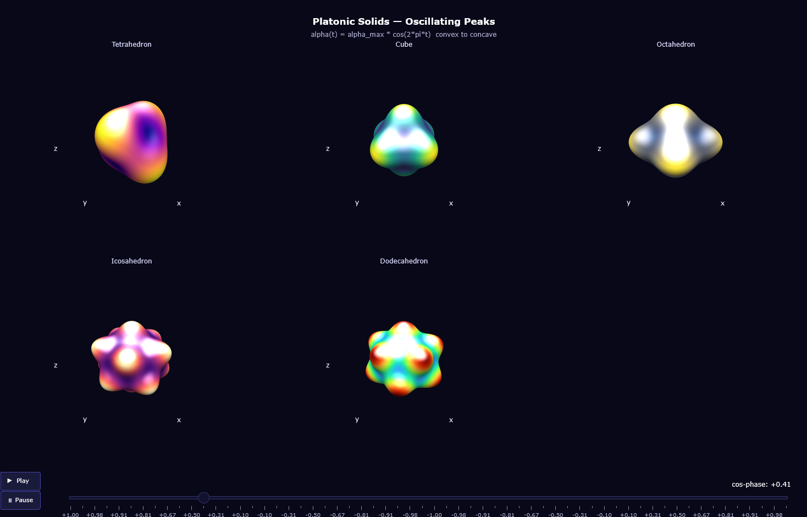

# Platonic Solids — Oscillating Peaks Animation
## Convex ↔ Concave morphing via Spherical Harmonics

**Reference:** [Chebfun — Spherical Harmonics §6](https://www.chebfun.org/examples/sphere/SphericalHarmonics.html)

---

### Animation principle

The radial deformation amplitude $\alpha$ is swept through a full cosine cycle:

$$\alpha(t) = \alpha_{\max} \cdot \cos\!\left(\frac{2\pi\,k}{N_\text{frames}}\right), \quad k = 0,1,\dots,N_\text{frames}-1$$

| Phase | $\alpha$ | Shape |
|---|---|---|
| $k=0$ | $+\alpha_{\max}$ | **Fully convex** — normal solid |
| $k=N/4$ | $0$ | **Unit sphere** — no deformation |
| $k=N/2$ | $-\alpha_{\max}$ | **Fully concave** — inverted solid |
| $k=3N/4$ | $0$ | **Unit sphere** again |

The surface colour (driven by the static $\hat{Y}_\ell^m$ field) stays fixed —
only the geometry oscillates, making the convex/concave transition visually clear.

> **Controls:** ▶ Play · ⏸ Pause · drag the frame slider below each figure
---

## Appendix · Cosine oscillation math

The oscillation is driven by a **pure cosine sweep** of the deformation amplitude:

$$\alpha(k) = \alpha_{\max} \cos\!\left(\frac{2\pi k}{N_{\text{frames}}}\right),
\quad k = 0, 1, \dots, N_{\text{frames}}-1$$

Key frames:

| $k$ | $\alpha / \alpha_{\max}$ | Geometry |
|---|---|---|
| $0$ | $+1$ | fully convex (poles out) |
| $N/4$ | $0$ | unit sphere |
| $N/2$ | $-1$ | fully concave (poles in) |
| $3N/4$ | $0$ | unit sphere |
| $N$ | $+1$ | back to convex |

The surface colour is **static** (driven by $\hat{Y}_\ell^m$) — warm tones mark
the lobes that push *outward* at $\alpha>0$ and inward at $\alpha<0$.

Tuning parameters:

```python
N_FRAMES = 60    # increase for smoother animation, larger file
FRAME_MS  = 55   # ms/frame ≈ 18 fps;  lower = faster playback
N = 120          # grid resolution;  200 gives smoother surface
```

---
*[Chebfun §6 — Spherical Harmonics](https://www.chebfun.org/examples/sphere/SphericalHarmonics.html)*
